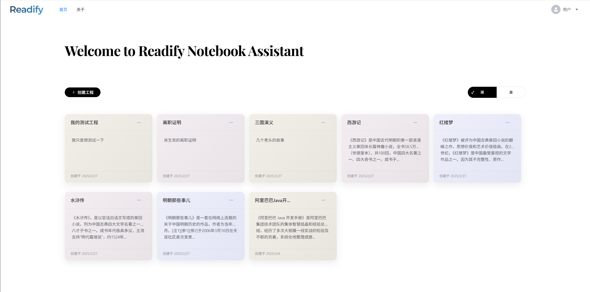
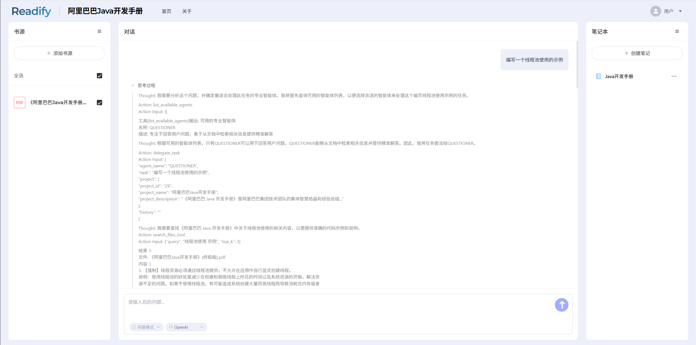
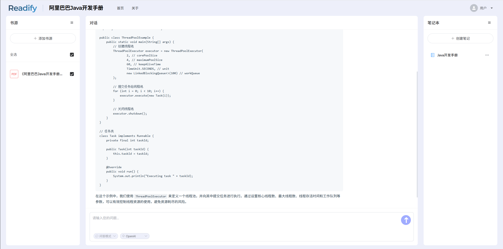
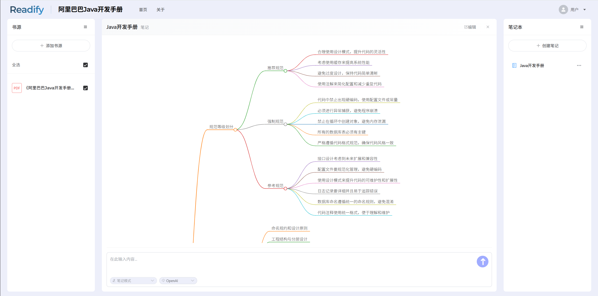
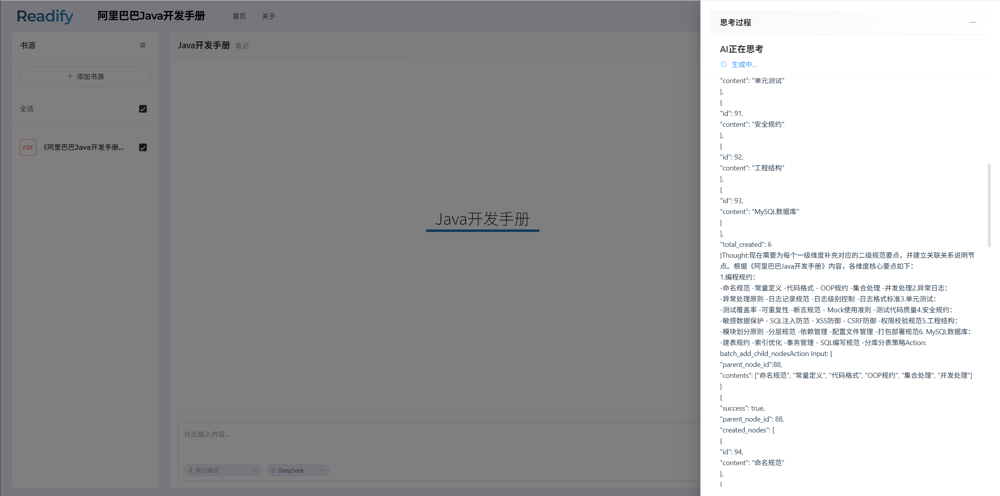
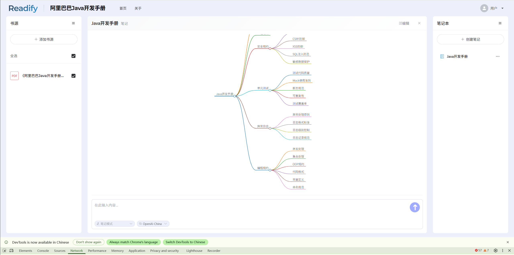

# Readify - 智能阅读笔记助手

<div align="center">
  <h3>基于AI的智能阅读笔记和思维导图生成工具</h3>

  
  
  
  
  
</div>

## 项目概述

Readify是一个智能阅读笔记助手系统，通过AI技术帮助用户轻松整理知识并生成直观的思维导图。项目采用微服务架构，由五个核心模块组成：

- **readify_frontend** - 基于 Vue 3 + TypeScript 的前端应用
- **readify_server** - 基于 Spring Boot 3.2.2 的后端服务（DDD架构）
- **readify_agi** - 基于 FastAPI 的 AI 服务层（多Agent系统）
- **readify_admin** - 基于 Vue 3 + TypeScript 的管理后台（RBAC权限管理）
- **readify_eval** - 评测平台（包含 backend/frontend 两部分）

## 功能展示

<div align="center">
  
  <p><i>首页 - 项目管理和文档上传</i></p>

  
  <p><i>对话界面 - 思考过程</i></p>

  
  <p><i>对话界面 - 最终答案</i></p>

  
  <p><i>笔记界面 - 笔记管理</i></p>

  
  <p><i>笔记生成 - 自动分析</i></p>

  
  <p><i>笔记生成 - 结果展示</i></p>
</div>

## 核心功能

- **智能问答** - 基于RAG（检索增强生成）的文档问答，结合向量检索和LLM
- **智能笔记生成** - 支持多层级生成结构化笔记
- **思维导图可视化** - 直观展示知识结构和关系
- **多Agent协作** - Coordinator、Ask、Note等多智能体协作
- **多种AI模型支持** - 支持OpenAI、Qwen、DeepSeek等大语言模型
- **多格式文档支持** - 支持PDF、TXT、DOCX等文档格式（通过LlamaParse解析）
- **实时交互反馈** - 思考过程通过WebSocket实时展示

## 技术架构

```
readify_parent/
├── readify_frontend/    # Vue 3 前端项目
├── readify_server/      # Spring Boot 后端服务
├── readify_agi/         # FastAPI AI智能体服务
├── readify_admin/       # Vue 3 管理后台
├── readify_eval/        # 评测平台（backend/frontend）
└── infra/               # 基础设施配置（Docker Compose）
```

### 服务通信流程

```
前端 (5173) → 后端服务 (8080) → AGI 服务 (8090)
                    ↓                ↓
                 Nacos (8848) ← 服务发现与注册
                    ↓
                MySQL (共享数据库)
                    ↓
              Milvus (向量数据库)
                    ↓
              MinIO (对象存储)
```

### 技术栈详情

| 模块 | 技术栈 |
|------|--------|
| **Frontend** | Vue 3, TypeScript, Element Plus, Vite, markmap.js |
| **Server** | Java 17, Spring Boot 3.2.2, MyBatis-Plus, Spring Cloud |
| **AGI** | Python 3.9+, FastAPI, LangChain, OpenAI SDK |
| **数据库** | MySQL 8.0+ (业务数据), Milvus (向量存储) |
| **存储** | MinIO (对象存储) |
| **服务发现** | Nacos 2.x |

### 核心工作流

1. **文档处理**：上传 → Server存储到MinIO → AGI解析(LlamaParse) → 向量化 → 存储到Milvus
2. **智能问答**：提问 → Coordinator Agent → Ask Agent (RAG + LLM) → WebSocket流式响应
3. **笔记生成**：请求 → Note Agent → 结构化笔记/思维导图

## 快速开始

### 前提条件

- Node.js 16+
- JDK 17+
- Python 3.9+
- MySQL 8.0+
- Docker & Docker Compose (用于基础设施)

### 一键启动（推荐）

在仓库根目录执行：

```powershell
powershell -ExecutionPolicy Bypass -File .\start-all.ps1
```

可选参数：

```powershell
# 跳过某些服务
.\start-all.ps1 -SkipInfra
.\start-all.ps1 -SkipAgi
.\start-all.ps1 -SkipServer
.\start-all.ps1 -SkipFrontend

# 强制重建后端
.\start-all.ps1 -RebuildServer
```

说明：
- 会自动启动基础设施（Nacos/MySQL/Milvus/MinIO）、AGI、Server、Frontend。
- 前端会在 `readify_frontend` 目录自动执行 `npm install`（仅首次）和 `npm run dev`。

### 1. 启动基础设施

```bash
cd infra
docker-compose up -d
```

这将启动以下服务：
- **Nacos** - 服务注册与配置中心 (端口: 8848)
- **MySQL** - 关系型数据库 (端口: 3306)
- **Milvus** - 向量数据库 (端口: 19530)
- **MinIO** - 对象存储 (端口: 9000, 控制台: 9001)

### 2. 初始化数据库

```bash
# 导入数据库结构
mysql -u root -p < readify_server/src/main/resources/db/migration/db.sql
```

### 3. 配置后端服务 (readify_server)

```bash
cd readify_server
# 修改配置文件或通过Nacos配置中心管理
vim src/main/resources/application.yml
```

主要配置项：
- `spring.cloud.nacos.*` - Nacos连接配置
- `readify.file.storage-type` - 存储类型 (minio/local)
- `readify.file.minio.*` - MinIO连接配置

### 4. 配置AGI服务 (readify_agi)

```bash
cd readify_agi
cp .env.example .env
vim .env
```

主要配置项：
```env
# 数据库配置
DB_HOST=localhost
DB_PORT=3306
DB_USER=root
DB_PASSWORD=your_password
DB_NAME=readify

# Milvus向量数据库
MILVUS_HOST=localhost
MILVUS_PORT=19530

# MinIO对象存储
MINIO_ENDPOINT=localhost:9000
MINIO_ACCESS_KEY=minioadmin
MINIO_SECRET_KEY=minioadmin

# LLM配置
LLM_API_KEY=your_api_key
LLM_API_BASE=https://api.openai.com/v1
LLM_MODEL_NAME=gpt-4o

# Embedding模型
EMBEDDING_API_KEY=your_api_key
EMBEDDING_API_BASE=https://api.openai.com/v1
EMBEDDING_MODEL=text-embedding-3-small

# LlamaParse文档解析
LLAMA_PARSE_API_KEY=your_api_key

# Nacos配置（可选）
NACOS_ENABLED=false
NACOS_SERVER_ADDR=127.0.0.1:8848
```

### 5. 启动服务

```bash
# 启动后端服务
cd readify_server
./mvnw spring-boot:run

# 启动AGI服务
cd readify_agi
pip install -r requirements.txt
python main.py

# 启动前端
cd readify_frontend
npm install
npm run dev
```

### 6. 访问应用

- **前端应用**: http://localhost:5173
- **Server Swagger**: http://localhost:8080/swagger-ui.html
- **AGI OpenAPI**: http://localhost:8090/docs
- **Nacos控制台**: http://localhost:8848/nacos (用户名/密码: nacos/nacos)
- **MinIO控制台**: http://localhost:9001 (用户名/密码: minioadmin/minioadmin)

## 开发命令

### 前端 (readify_frontend)
```bash
npm install          # 安装依赖
npm run dev          # 启动开发服务器 (端口 5173)
npm run build        # 生产环境构建
npm run preview      # 预览生产构建
```

### 后端 (readify_server)
```bash
./mvnw clean package                    # 构建项目
./mvnw spring-boot:run                  # 启动服务 (端口 8080)
./mvnw test                             # 运行测试
./mvnw test -Dtest=类名                  # 运行单个测试类
```

### AGI服务 (readify_agi)
```bash
pip install -r requirements.txt    # 安装依赖
python main.py                     # 启动服务 (端口 8090)
pytest tests/                      # 运行测试
```

## 项目结构

### readify_server (DDD架构)

```
com.readify.server/
├── domain/              # 领域层
│   ├── auth/            # 认证领域
│   ├── conversation/    # 对话领域
│   ├── file/            # 文件领域
│   ├── mind_map/        # 思维导图领域
│   ├── notetask/        # 笔记任务领域
│   ├── project/         # 项目领域
│   └── user/            # 用户领域
├── infrastructure/      # 基础设施层
│   ├── persistence/     # 持久化（entity, mapper, converter）
│   ├── security/        # 安全（JWT, 过滤器）
│   ├── common/          # 通用组件
│   └── utils/           # 工具类（文件存储等）
├── interfaces/          # 接口层
│   └── */               # REST控制器
└── websocket/           # WebSocket处理器
```

### readify_agi (多Agent架构)

```
app/
├── api/v1/           # FastAPI路由
├── core/             # 配置、数据库、Nacos客户端
├── models/           # SQLAlchemy模型
├── repositories/     # 数据访问层（异步）
├── services/         # 业务逻辑和Agent服务
│   ├── coordinator_agent_service.py  # 协调Agent
│   ├── ask_agent_service.py          # 问答Agent (RAG)
│   ├── note_agent_service.py         # 笔记Agent
│   ├── vector_store_service.py       # 向量存储服务
│   └── file_vectorize_service.py     # 文件向量化服务
└── prompts/          # LLM提示词模板
```

## 功能模块

### 前端模块
- **用户界面**: 登录注册、项目管理、文件上传
- **笔记系统**: 笔记查看、编辑和管理
- **思维导图**: 基于markmap.js的交互式知识图谱
- **对话界面**: WebSocket实时交互问答

### 后端模块
- **用户认证**: 基于JWT的认证和权限控制
- **项目管理**: 创建和管理读书项目
- **文件管理**: 支持MinIO和本地存储
- **对话历史**: 记录用户与AI的交互历史

### AGI模块
- **智能体协调**: 多Agent协作，动态任务分配
- **文档处理**: LlamaParse解析、向量化、语义理解
- **知识问答**: 基于Milvus的RAG问答系统
- **笔记生成**: 自动生成结构化文档笔记

## 开发指南

### 代码风格
- 前端: 遵循ESLint和Vue风格指南
- 后端: 遵循Google Java风格指南
- AGI: 遵循PEP 8，使用类型提示，优先异步函数

### 开发规范
- 控制器统一返回 `Result<T>` 对象
- 请求DTO使用 `*Req` 后缀，视图对象使用 `*VO` 后缀
- 使用MapStruct进行对象映射，Lombok简化样板代码

## 贡献指南

1. Fork 本项目
2. 创建特性分支 (`git checkout -b feature/amazing-feature`)
3. 提交更改 (`git commit -m 'Add some amazing feature'`)
4. 推送到分支 (`git push origin feature/amazing-feature`)
5. 打开 Pull Request

## 许可证

[MIT License](LICENSE)

---

<div align="center">
  <p>Made with ❤️ by Readify</p>
</div>
